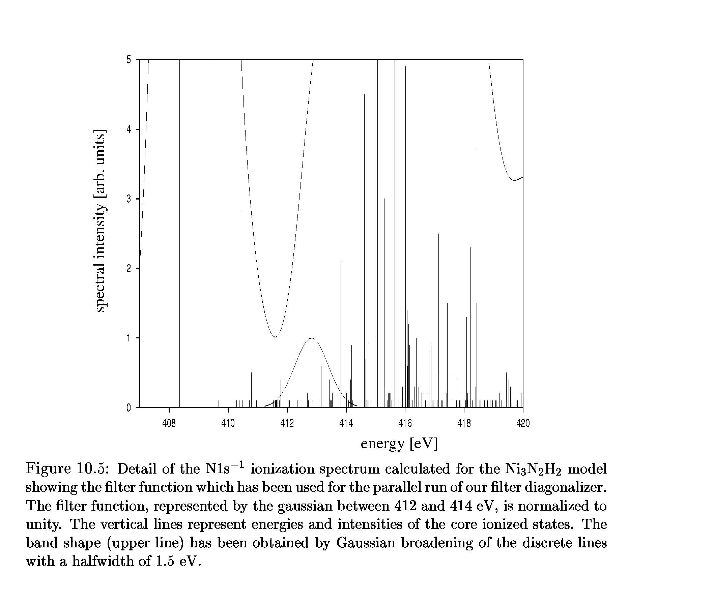

# Results

A parallel implementation of the filter diagonalization library has
been used to investigate the N-1s-core Ionization
spectrum for Nitrogen molecules which are absorbed on a Nickel surface.
The ADC(4) matrix dimension was here 842192!

A total number of 120 starting vectors has been sent to the filtering
process. Each machine of the Linux Cluster processed 15 vectors for a total
memory cost below 450 Mbytes. 5 Eigenvectors have been found in the
dense spectral region between 412.0 and 413.4 eV.

